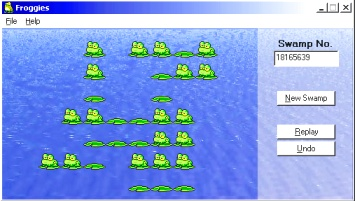



## A 2D game \- Froggies, a game of leap frog\.

### Description

Simple game of leap-frog suitable for all ages.

Uses multi-dimension arrays, images and bitmaps, drag-n-drop, simple game logic, auto-creation of new swamps, registry setting! Unlike other games, this one has a well-rounded finish to it, including help file.

Code is commented, and does not assume too much VB knowledge. If you are not too good at Arrays, then you may need a quick refresher course, otherwise this is a good learning project for them.
 
### More Info
 

             |
---                |---
**Submitted On**   |2003-01-21 23:10:06
**By**             |[Peter Wilson](https://github.com/Planet-Source-Code/PSCIndex/blob/master/ByAuthor/peter-wilson.md)
**Level**          |Beginner
**User Rating**    |5.0 (110 globes from 22 users)
**Compatibility**  |VB 6\.0
**Category**       |[Games](https://github.com/Planet-Source-Code/PSCIndex/blob/master/ByCategory/games__1-38.md)
**World**          |[Visual Basic](https://github.com/Planet-Source-Code/PSCIndex/blob/master/ByWorld/visual-basic.md)
**Archive File**   |[A\_2D\_game\_1543642132003\.zip](https://github.com/Planet-Source-Code/peter-wilson-a-2d-game-froggies-a-game-of-leap-frog__1-35882/archive/master.zip)

